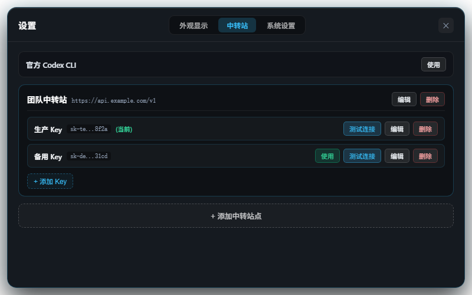
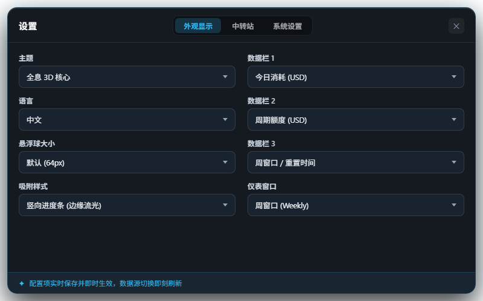
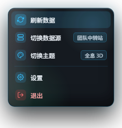
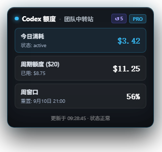
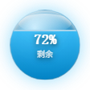
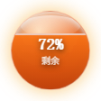

# Codex Quota Monitor

[简体中文](README.md)

A local desktop quota widget for Codex. It can read a signed-in local Codex CLI, or query a third-party provider that exposes a compatible `sub2api` usage endpoint. Quota data is shown in a full panel or a floating ball.

> This is not an official OpenAI product and is not endorsed by any provider. Domains, amounts, and keys in the screenshots are sample data.

## Upstream and secondary-development notice

This repository is forked from [359956085/codex-widget](https://github.com/359956085/codex-widget) and is developed under the upstream MIT License. The current fork adds third-party usage monitoring, multi-provider/multi-key management, connection testing, and source switching.

MIT permits use, modification, and redistribution. When publishing a derived version:

- Keep [`LICENSE`](LICENSE), the upstream copyright notice, and the license text.
- Credit the upstream project and describe your changes in the README, About page, or Release notes.
- Avoid names, icons, or wording that imply endorsement by the upstream author or OpenAI.
- Check licenses for added dependencies and provider APIs. Never commit API keys, passwords, certificates, or local settings.

The upstream instructions that still apply—installation, Codex CLI path selection, floating-ball controls, and basic settings—are retained below and updated for this fork. The old theme gallery, legacy screenshots, and the long formula-only documentation for official quota estimation were removed because they do not describe the third-party usage mode.

## Features added by this fork

Compared with the upstream project, this fork focuses on these additions and improvements:

- **Third-party provider adapter**: reads today cost, cycle quota, and weekly-window data from a compatible `sub2api` usage endpoint.
- **Multi-site & multi-key management**: configure multiple provider sites and normalize `/v1/usage` request URLs; store multiple API keys per site with masking, editing, deletion, and activation.
- **Connection testing & instant switching**: validate providers before saving or switching; data source switching responds immediately with silent background refresh.
- **Provider-specific quota cards**: render “today cost / cycle quota / weekly window” without applying the official CLI estimate logic.
- **Unified Quick Menu**: right-clicking either the floating ball or main panel invokes a sleek dark-glass quick menu to refresh data, switch sources, switch themes, open settings, or quit.
- **System tray preview**: hover over the tray icon to reveal an instant glowing quota preview card with status indicators, active provider name, and live quota cards without opening the full window.
- **Floating ball docking modes (Vertical mini dock bar)**: switch edge docking between hemispherical snap and a slender vertical mini progress bar with left/right edge awareness, dynamic glow, and adaptive sizing.
- **Smart floating ball & settings transition**: opening settings in floating ball mode transitions smoothly into the centered settings panel and returns automatically to floating ball mode when closed.
- **Categorized settings & immediate persistence**: expanded `800 × 500` settings layout categorized into Appearance, Provider, and System tabs, with immediate persistence for all options.
- **Refactored 3D dashboard foundation**: eliminated legacy code, unified 3D dashboard base, and standardized data source contracts across official and provider modes.

Upstream panel, floating ball, theme rendering, auto-refresh, and desktop foundation remain supported.

## Screenshots

Below are screenshots of core features, quick interactions, and available themes:

### Core features & settings

<table>
  <tr>
    <td width="50%"><strong>Provider & key management</strong><br></td>
    <td width="50%"><strong>Categorized settings (changes apply immediately)</strong><br></td>
  </tr>
</table>

### Quick interactions & docking styles

<table>
  <tr>
    <td width="33%"><strong>Unified Quick Menu</strong><br></td>
    <td width="33%"><strong>Tray quota preview</strong><br></td>
    <td width="34%"><strong>Vertical dock bar snap</strong><br></td>
  </tr>
</table>

### Floating balls across themes

<table>
  <tr>
    <td width="50%"><strong>Holo 3D Core floating ball</strong><br></td>
    <td width="50%"><strong>Pyro Core floating ball</strong><br></td>
  </tr>
</table>

These images are rendered from the current branch’s frontend components and styles with sample data. Keys are masked; never place real credentials in screenshots, README files, or Issues.

## Usage

### 1. Official Codex CLI

1. Install and sign in to Codex CLI.
2. Start the app. It tries to find `codex` or `codex.exe` automatically.
3. If reading fails, open **Settings → System Settings** and choose the Codex CLI path.
4. Use the full panel for quota details. Click the circle button to switch to the floating ball; double-click the ball to restore the panel.
5. Right-click the floating ball or main panel to open the Quick Menu for instant refresh, source switching, and settings.

### 2. Third-party provider

1. Open **Settings → 中转站** and click **添加中转站点**.
2. Enter a site name and Base URL. The request URL is normalized as follows:
   - a Base URL ending in `/v1` uses `${BaseURL}/usage`;
   - any other Base URL uses `${BaseURL}/v1/usage`.
3. Add one or more API keys and click **测试连接** to validate the endpoint and credentials.
4. Click **使用** to activate a target. The main panel then shows the provider’s today cost, cycle quota, and weekly reset window.

The provider must return JSON usage data containing at least one of `status`, `rate_limits`, or `usage`. See [`src-tauri/src/quota/sub2api.rs`](src-tauri/src/quota/sub2api.rs) for the exact parser. Requests include both `Authorization: Bearer <API_KEY>` and `X-API-Key` headers.

## Configuration and privacy

- Official mode calls only the local Codex CLI and reuses its local sign-in state; local session logs are not uploaded.
- Third-party mode sends requests to the Base URL you choose, and the API key is sent to that provider. Review the provider’s privacy and data-handling policy.
- Sites and keys are stored in `settings.json` under the app’s local configuration directory. The current version does not provide end-to-end encryption for keys; protect this file with local file permissions and never commit or share it.
- Use placeholder domains and masked credentials in screenshots, logs, Issues, and example configuration.

## Local development

Requirements: Node.js, npm, Rust, and the Tauri build prerequisites. PowerShell is recommended on Windows.

```powershell
# Install locked frontend dependencies
npm ci

# Start Tauri development mode
npm run tauri:dev

# Frontend checks
npm run lint
npm test
npm run build:frontend

# Rust tests
cargo test --locked --manifest-path src-tauri/Cargo.toml

# Full check (frontend audit + Rust fmt/clippy/test)
npm run check
```

Before publishing, verify that:

- `npm run check` passes;
- Releases contain installers and their checksums/signatures, while `.exe` files, `src-tauri/target`, and local settings stay out of the source repository;
- README, About, and Release pages keep the upstream attribution, MIT notice, and unofficial-product statement;
- the updater points to your own GitHub Releases, unless you intentionally keep and document the upstream endpoint.

Common build commands:

```powershell
# Windows NSIS installer
npm run tauri:build:nsis

# Windows portable executable (no installer; output: src-tauri/target/release/CodexWidget.exe)
npm run tauri:build:portable

# GitHub Release artifacts
npm run release:github
```

The portable build does not create an installer or install WebView2 automatically; the target machine must already have the WebView2 Runtime. Treat the executable as a release artifact and distribute it through GitHub Releases or another delivery channel instead of committing it to the source repository.

## Project layout

```text
codex-widget-monitor/
├─ .github/workflows/   # CI and release workflows
├─ docs/assets/         # README screenshots and feature previews
├─ src/                 # Frontend UI, themes, and interactions
│  ├─ quick-menu/       # Unified right-click quick menu
│  ├─ tray-preview/     # System tray quota preview
│  └─ components/       # 3D dashboard & visual components
├─ src-tauri/           # Rust backend, Tauri config, and provider adapter
├─ scripts/             # Build/release helpers
├─ index.html           # Main window entry
├─ quick-menu.html      # Quick menu entry
├─ tray-preview.html    # Tray preview entry
├─ package.json         # Dependencies and scripts
└─ README.md
```

## License

This project follows the MIT License in [`LICENSE`](LICENSE). The upstream copyright and license notice remain effective; new code, assets, and dependencies are subject to their applicable licenses.
