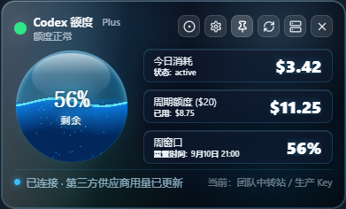

# Codex Quota Monitor

[简体中文](README.md)

A local desktop quota widget for Codex. It can read a signed-in local Codex CLI, or query a third-party provider that exposes a compatible `sub2api` usage endpoint. Quota data is shown in a full panel or a floating ball.

> This is not an official OpenAI product and is not endorsed by any provider. Domains, amounts, and keys in the screenshots are sample data.

## Upstream and secondary-development notice

This repository is forked from [359956085/codex-widget](https://github.com/359956085/codex-widget) and is developed under the upstream MIT License. The current fork adds third-party usage monitoring, multi-provider/multi-key management, connection testing, and source switching.

MIT permits use, modification, and redistribution. When publishing a derived version:

- Keep [`LICENSE`](LICENSE), the upstream copyright notice, and the license text.
- Credit the upstream project and describe your changes in the README, About page, or Release notes.
- Avoid names, icons, or wording that imply endorsement by the upstream author or OpenAI.
- Check licenses for added dependencies and provider APIs. Never commit API keys, passwords, certificates, or local settings.

The upstream instructions that still apply—installation, Codex CLI path selection, floating-ball controls, and basic settings—are retained below and updated for this fork. The old theme gallery, legacy screenshots, and the long formula-only documentation for official quota estimation were removed because they do not describe the third-party usage mode.

## Features added by this fork

Compared with the upstream project, this fork mainly adds and maintains:

- **Third-party provider adapter**: reads today cost, cycle quota, and weekly-window data from a compatible `sub2api` usage endpoint.
- **Multi-site management**: configure multiple provider sites and normalize their `/v1/usage` request URL.
- **Multi-key management**: store multiple API keys per site with masking, editing, deletion, and activation.
- **Connection testing**: validate a provider before saving or switching, with clear success, authentication, and API error feedback.
- **Source switching**: switch between the official Codex CLI and a provider, with the active site and key shown in the main panel.
- **Provider-specific quota cards**: render “today cost / cycle quota / weekly window” without applying the official CLI estimate logic.

The upstream panel, floating ball, edge docking, themes, refresh, and desktop settings remain available but are not repeated here; installation and basic usage are documented below.

## Screenshots

### Third-party usage monitoring (Holo 3D Core)



### Provider and key management


### Pyro Core theme


### Floating-ball mode


These images are rendered from the current branch’s frontend components and styles. Keys are masked; never place real credentials in screenshots, README files, or Issues.

## Usage

### 1. Official Codex CLI

1. Install and sign in to Codex CLI.
2. Start the app. It tries to find `codex` or `codex.exe` automatically.
3. If reading fails, open **Settings → 基础设置** and choose the Codex CLI path.
4. Use the full panel for quota details. Click the circle button to switch to the floating ball; double-click the ball to restore the panel.

### 2. Third-party provider

1. Open **Settings → 中转站** and click **添加中转站点**.
2. Enter a site name and Base URL. The request URL is normalized as follows:
   - a Base URL ending in `/v1` uses `${BaseURL}/usage`;
   - any other Base URL uses `${BaseURL}/v1/usage`.
3. Add one or more API keys and click **测试连接** to validate the endpoint and credentials.
4. Click **使用** to activate a target. The main panel then shows the provider’s today cost, cycle quota, and weekly reset window.

The provider must return JSON usage data containing at least one of `status`, `rate_limits`, or `usage`. See [`src-tauri/src/quota/sub2api.rs`](src-tauri/src/quota/sub2api.rs) for the exact parser. Requests include both `Authorization: Bearer <API_KEY>` and `X-API-Key` headers.

## Configuration and privacy

- Official mode calls only the local Codex CLI and reuses its local sign-in state; local session logs are not uploaded.
- Third-party mode sends requests to the Base URL you choose, and the API key is sent to that provider. Review the provider’s privacy and data-handling policy.
- Sites and keys are stored in `settings.json` under the app’s local configuration directory. The current version does not provide end-to-end encryption for keys; protect this file with local file permissions and never commit or share it.
- Use placeholder domains and masked credentials in screenshots, logs, Issues, and example configuration.

## Local development

Requirements: Node.js, npm, Rust, and the Tauri build prerequisites. PowerShell is recommended on Windows.

```powershell
# Install locked frontend dependencies
npm ci

# Start Tauri development mode
npm run tauri:dev

# Frontend checks
npm run lint
npm test
npm run build:frontend

# Rust tests
cargo test --locked --manifest-path src-tauri/Cargo.toml

# Full check (frontend audit + Rust fmt/clippy/test)
npm run check
```

Before publishing, verify that:

- `npm run check` passes;
- Releases contain installers and their checksums/signatures, while `.exe` files, `src-tauri/target`, and local settings stay out of the source repository;
- README, About, and Release pages keep the upstream attribution, MIT notice, and unofficial-product statement;
- the updater points to your own GitHub Releases, unless you intentionally keep and document the upstream endpoint.

Common build commands:

```powershell
# Windows NSIS installer
npm run tauri:build:nsis

# GitHub Release artifacts
npm run release:github
```

## Project layout

```text
codex-widget-monitor/
├─ .github/workflows/   # CI and release workflows
├─ docs/assets/         # README screenshots
├─ src/                 # Frontend UI, themes, and interactions
├─ src-tauri/           # Rust backend, Tauri config, and provider adapter
├─ scripts/             # Build/release helpers
├─ index.html           # Vite entry page
├─ package.json         # Frontend dependencies and npm scripts
└─ README.md
```

## License

This project follows the MIT License in [`LICENSE`](LICENSE). The upstream copyright and license notice remain effective; new code, assets, and dependencies are subject to their applicable licenses.
